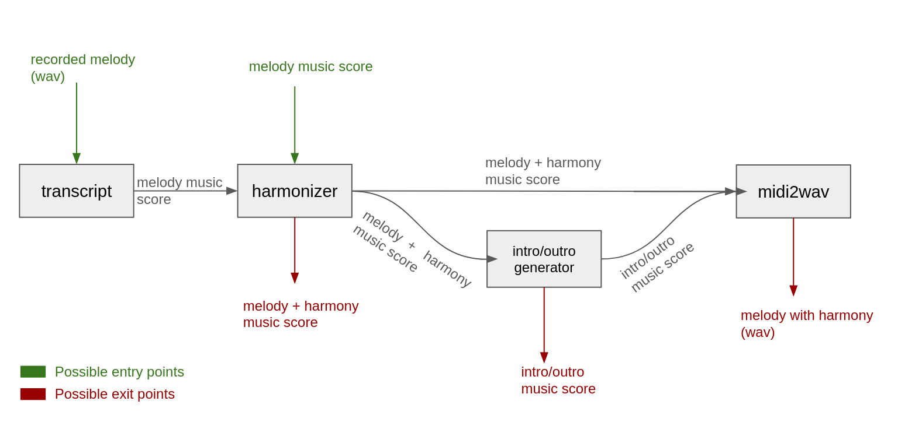

# HarmonyPal

HarmonyPal is an AI-based system to generate four-voice harmonizations of a given monophonic melody providing with its music score or audio recordings. It extends functionality to create introductions, preludes, and postludes, ensuring stylistic fidelity to renowned composers, musicians or musical styles. 

## Scheme of the system's workflow


## Main concepts
The system contains of the following blocks (as in the scheme above):
- Transcript
- Harmonizer
- Intro/outro generator
- MidiToWave

Note that the system itself serves variety of functionalities and input or output data formats (entry/exit points of the scheme) may vary depending on the user's purpose.

## Detailed description of the components

### Transcript
The Transcript module serves as one of the entry points and its aim is to transcribe the one-voice melody in WAV or MP3 format into a digital form of music score such as MIDI or MusicXML. This transcription is then forwarded for subsequent processing.

### Harmonizer
The Harmonizer is the core component, responsible for generating stylistically accurate four-voice harmonizations. The harmonies produced by Harmonizer will form the foundation for the creation of musical arrangements by Intro/outro generator. Please note that Harmonizer can function as both the system's entry point and the exit one.

### Intro/outro generator
The Intro/Outro Generator extends the given harmonization by creating stylistically cohesive preludes, introductions, or postludes. The followed stylistic shall be chosen beforhand. The outcome is then stored in the digital music score form such as MIDI or MusicXML.

### MidiTo Wave
The MidiToWave module is responsible for converting digital MIDI or MusicXML files into audio recordings. Its primary functions is to  render the generated harmony or musical arrangement, enabling the user to efficiently evaluate and verify the output of the generation process.

## Installation and Usage
1. Clone the repository,
2. Download and extract the model from: 
   [https://drive.google.com/file/d/1v5iaw_sf0HgEaeOntVIIerykm5BGGf8y/view](https://drive.google.com/file/d/1v5iaw_sf0HgEaeOntVIIerykm5BGGf8y/view)
3. Install the requirements from `requirements.txt` (Python 3.8 recommended): 
   ```bash
   pip install -r requirements.txt
4. To be able to play the harmonized file as .wav install midi2audio to synthesize generated MIDI to audio (optional):
    ```bash
   pip install midi2audio
   wget https://freepats.zenvoid.org/Piano/SalamanderGrandPiano/SalamanderGrandPiano-SF2-V3+20200602.tar.xz
   tar -xvf SalamanderGrandPiano-SF2-V3+20200602.tar.xz

5.  Place the .mp3 file to harmonize in the repository root directory, 
6. Run the script:
   ```bash
   python3 harmonyPal.py --audio_file <path to your audio file> --key <letter indicating the key of the harmonized file> [--play_wav]
7. The harmonized melody will be stored in EMO_Harmonizer/generation/emopia_functional_rule/... catalog as the .mid file, alongside with .wav (if --play_wav flag was present). To open as music score I recommand importing the files to MusicScore. 

## Contributing
Pull requests are welcome. For major changes, please open an issue first
to discuss what you would like to change.

## License

[MIT](https://choosealicense.com/licenses/mit/)
